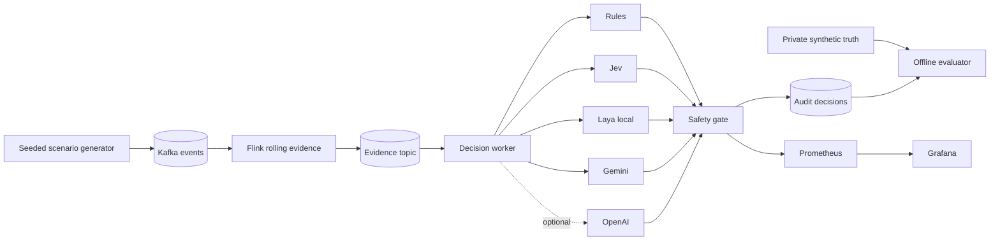

# JevOps

**An evidence-first benchmark and live reference pipeline for bounded operational decisions.**

JevOps answers one practical question: when several decision engines see the same operational facts, which engine classifies the incident correctly, recommends an acceptable next action, and stays inside explicit safety constraints?

[Latest benchmark report](docs/benchmark-results-2026-10-02.md) · [Architecture](docs/architecture.md) · [Machine-readable results](results/2026-10-02/)

## What the project demonstrates

- **Fair comparison:** Rules, Jev, local Laya, and Gemini receive the same immutable `EvidenceSnapshot` and action vocabulary.
- **No answer leakage:** scenario names, seeds, expected actions, and future events remain evaluator-only.
- **Auditable decisions:** every record preserves the evidence hash, raw recommendation, latency, provider status, and safety-gated action.
- **Deterministic control:** models recommend actions; deterministic code owns aggregation, prerequisites, and the final safety gate.
- **Two domains:** StreamGuard covers streaming incidents; PayRecon covers payment projection and delivery exceptions.

This repository is a benchmark and local demonstration. It does not execute infrastructure changes or move funds.

## Architecture



The live path is `generator → Kafka → Flink → evidence → adapters → safety gate → audit and metrics`. The offline benchmarks reuse the same evidence contract and adapters without requiring Kafka or Flink. See [the architecture document](docs/architecture.md) for trust boundaries and action prerequisites.

## Evaluated engines

| Engine | Execution | Credential | Default |
| --- | --- | --- | --- |
| Rules | Deterministic local code | None | Enabled |
| Jev | Remote typed-choice API | `TYPESAFE_API_KEY` | Enabled |
| Laya | Local choice model, general English checkpoint | None | Enabled |
| Gemini 3.5 Flash-Lite | Remote structured output | `GEMINI_API_KEY` | Enabled |
| OpenAI adapter | Remote structured output | `OPENAI_API_KEY` | Disabled and excluded from published results |

Missing credentials produce an explicit `UNAVAILABLE` result. The benchmark never substitutes mocked provider answers.

## Verified results

The latest committed run was produced on **2 October 2026** with one run per case, three seeds per scenario, OpenAI disabled, and Laya on CPU. All 180 provider attempts returned `OK`.

### StreamGuard — 8 scenarios × 3 seeds

| Engine | Raw action accuracy | Incident class accuracy | Unsafe raw recommendations | Median latency |
| --- | ---: | ---: | ---: | ---: |
| Rules | 24/24 (100%) | 24/24 (100%) | 0/24 | 0.008 ms |
| Jev | 18/24 (75.0%) | 21/24 (87.5%) | 0/24 | 490 ms |
| Gemini 3.5 Flash-Lite | 15/24 (62.5%) | 18/24 (75.0%) | 0/24 | 979 ms |
| Laya | 7/24 (29.2%) | 15/24 (62.5%) | 0/24 | 693 ms |

### PayRecon — 7 scenarios × 3 seeds

| Engine | Raw action accuracy | Incident class accuracy | Unsafe raw recommendations | Median latency |
| --- | ---: | ---: | ---: | ---: |
| Rules | 18/21 (85.7%) | 18/21 (85.7%) | 0/21 | 0.004 ms |
| Gemini 3.5 Flash-Lite | 17/21 (81.0%) | 20/21 (95.2%) | 3/21 | 971 ms |
| Jev | 9/21 (42.9%) | 21/21 (100%) | 6/21 | 495 ms |
| Laya | 3/21 (14.3%) | 5/21 (23.8%) | 9/21 | 700 ms |

Accuracy and unsafe recommendation metrics score the **raw provider output** against private synthetic truth. The deterministic gate changed 34 PayRecon actions; after gating, none of the 180 effective actions matched an oracle-labeled unsafe action. That result covers this finite synthetic matrix and is not a general safety guarantee.

Full methodology, p95 latency, interpretation, and limitations are in the [latest benchmark report](docs/benchmark-results-2026-10-02.md). Raw JSONL and summaries are committed under [`results/2026-10-02/`](results/2026-10-02/).

## Quick start

### Requirements

- Python 3.12 or newer
- Docker with Compose for the live pipeline
- Provider keys only for the remote engines you want to run

### Install and validate

```bash
cp .env.example .env
# Add TYPESAFE_API_KEY and GEMINI_API_KEY to .env as needed.

make setup
make test
make verify-results
```

`make verify-results` recomputes each committed summary from its raw JSONL and verifies that all engines shared one evidence hash per case.

### Run the offline benchmarks

```bash
set -a && source .env && set +a
make benchmark
```

Outputs are written to `artifacts/`, which is ignored by Git. Each benchmark writes raw JSONL and a sibling `.summary.json` file.

### Run the live StreamGuard pipeline

```bash
make up

docker compose run --rm scenario-generator \
  --scenario traffic_spike_sink_degradation \
  --seed 401 \
  --duration 60 \
  --interval 0.25
```

Open:

- [Grafana dashboard](http://localhost:3000/d/streamguard-live/streamguard-live-demo)
- [Flink job dashboard](http://localhost:8081)
- [Prometheus](http://localhost:9090)
- [Raw decision metrics](http://localhost:8000/metrics)

Stop the stack with `make down`. Use `docker compose down -v` only when you also want to remove Kafka data and the cached Laya model.

## Scenarios

StreamGuard includes `normal`, `traffic_spike`, `sink_slowdown_recoverable`, `sink_failure_persistent`, `ambiguous_early`, `intermittent_failure`, `false_recovery`, and `traffic_spike_sink_degradation`.

PayRecon includes `normal`, `duplicate_delivery`, `late_settlement`, `out_of_order`, `missing_retained`, `projection_mismatch`, and `integrity_conflict`.

Run one case directly:

```bash
.venv/bin/python -m jevops simulate --scenario traffic_spike --seed 401 --show-truth
.venv/bin/python -m jevops payrecon --scenario projection_mismatch --seed 602 --show-truth
```

## Configuration

| Variable | Purpose | Default |
| --- | --- | --- |
| `TYPESAFE_API_KEY` | Enables Jev | Empty |
| `GEMINI_API_KEY` | Enables Gemini | Empty |
| `GEMINI_MODEL` | Gemini model identifier | `gemini-3.5-flash-lite` |
| `LAYA_ENABLED` | Enables local Laya inference | `true` |
| `LAYA_MODEL` | Laya repository or local path | `convaiinnovations/laya` |
| `LAYA_SUBFOLDER` | Optional alternate checkpoint | Empty, general English checkpoint |
| `LAYA_DEVICE` | `cpu`, `mps`, or `cuda`; empty lets Laya choose | Empty |
| `OPENAI_ENABLED` | Adds the optional OpenAI adapter | `false` |
| `OPENAI_API_KEY` | Credential for the optional OpenAI adapter | Empty |
| `DECISION_EVERY_N_SNAPSHOTS` | Live provider-call interval | `5` |

Laya downloads its model on first use and reuses it for the process lifetime. Local Laya latency excludes model loading. Jev and Gemini latency includes the API round trip, so the latency scopes should be compared with that distinction in mind.

## Repository map

```text
src/jevops/adapters/    shared provider interface and engine adapters
src/jevops/benchmark/   oracle scoring, summaries, and JSONL writers
src/jevops/streamguard/ offline stream simulation and action gate
src/jevops/streaming/   Kafka generator, live worker, and evidence processor
src/jevops/payrecon/    payment lifecycle simulation and action gate
flink/                  Java Flink rolling-evidence job
observability/          Prometheus and Grafana configuration
results/                versioned benchmark and live-run evidence
scripts/                result integrity checks
tests/                  contract, safety, adapter, and benchmark tests
```

## Known limits

- The datasets are synthetic and small: three seeds and one request per case in the published run.
- Rules are written against the synthetic evidence contract and should not be interpreted as production performance.
- Laya's general checkpoint is technically functional but has low task accuracy, especially on PayRecon.
- Kafka and Flink run as single-node local services with no authentication or high availability.
- The project has no action executor. Effective actions are audited recommendations only.

Do not commit `.env` or provider credentials. The repository includes only synthetic evidence and decision records that passed a credential scan.
