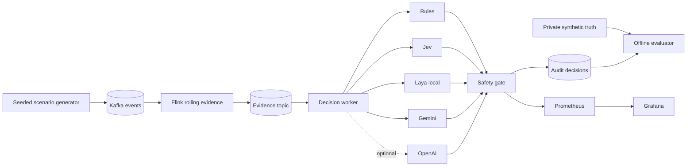

# JevOps

**An evidence-first benchmark and live reference pipeline for bounded operational decisions.**

JevOps answers one practical question: when several decision engines see the same operational facts, which engine classifies the incident correctly, recommends an acceptable next action, and stays inside explicit safety constraints?

[Latest benchmark report](docs/benchmark-results-2026-10-02-corrected.md) · [Architecture](docs/architecture.md) · [Machine-readable results](results/2026-10-02-corrected/)

## What the project demonstrates

- **Fair comparison:** Rules, Jev, local Laya, and Gemini receive the same immutable `EvidenceSnapshot` and action vocabulary.
- **No answer leakage:** scenario names, seeds, expected actions, and future events remain evaluator-only.
- **Auditable decisions:** every record preserves the evidence hash, raw recommendation, latency, provider status, and safety-gated action.
- **Deterministic control:** models recommend actions; deterministic code owns aggregation, prerequisites, and the final safety gate.
- **Two domains:** StreamGuard covers streaming incidents; PayRecon covers payment projection and delivery exceptions.

This repository is a benchmark and local demonstration. It does not execute infrastructure changes or move funds.

## Architecture



The live path is `generator → Kafka → Flink → evidence → adapters → safety gate → audit and metrics`. The offline benchmarks reuse the same evidence contract and adapters without requiring Kafka or Flink. See [the architecture document](docs/architecture.md) for trust boundaries and action prerequisites.

## Evaluated engines

| Engine | Execution | Credential | Default |
| --- | --- | --- | --- |
| Rules | Deterministic local code | None | Enabled |
| Jev | Remote typed-choice API | `TYPESAFE_API_KEY` | Enabled |
| Laya | Local choice model, general English checkpoint | None | Enabled |
| Gemini 3.5 Flash-Lite | Remote structured output | `GEMINI_API_KEY` | Enabled |
| OpenAI adapter | Remote structured output | `OPENAI_API_KEY` | Disabled and excluded from published results |

Missing credentials produce an explicit `UNAVAILABLE` result. The benchmark never substitutes mocked provider answers.

## Verified results

The corrected run on **2 October 2026** used three repeats per fixture, three seeds, OpenAI disabled, and native Apple MPS for Laya. All **540 primary decisions** and **135 paired Laya CPU controls** returned `OK`.

The previous Laya defaults silently truncated 69 of 90 question inputs. The adapter now verifies complete evidence, instructions, and options before inference. The common PayRecon action definitions were also aligned with the gate's prerequisites. Historical reports are marked as superseded.

### StreamGuard — 8 scenarios × 3 seeds × 3 repeats

| Engine | Raw action accuracy | Class accuracy | Unsafe raw | Median latency |
| --- | ---: | ---: | ---: | ---: |
| Rules | 72/72 (100.0%) | 72/72 (100.0%) | 0/72 | 0.006 ms |
| Jev | 55/72 (76.4%) | 63/72 (87.5%) | 0/72 | 486 ms |
| Gemini 3.5 Flash-Lite | 49/72 (68.1%) | 52/72 (72.2%) | 0/72 | 950 ms |
| Laya (MPS) | 45/72 (62.5%) | 18/72 (25.0%) | 0/72 | 519 ms |

### PayRecon — 7 scenarios × 3 seed identifiers × 3 repeats

| Engine | Raw action accuracy | Class accuracy | Unsafe raw | Median latency |
| --- | ---: | ---: | ---: | ---: |
| Rules | 63/63 (100.0%) | 63/63 (100.0%) | 0/63 | 0.005 ms |
| Gemini 3.5 Flash-Lite | 63/63 (100.0%) | 63/63 (100.0%) | 0/63 | 946 ms |
| Jev | 54/63 (85.7%) | 63/63 (100.0%) | 0/63 | 478 ms |
| Laya (MPS) | 18/63 (28.6%) | 27/63 (42.9%) | 12/63 | 461 ms |

The gate changed 54 PayRecon actions. None of the 540 effective actions was oracle-labeled unsafe. Raw accuracy and raw unsafe recommendations are scored before the gate. This finite matrix does not establish general safety.

With identical inputs and matching decisions, Laya CPU medians were **861 ms** on StreamGuard and **759 ms** on PayRecon, versus **519 ms** and **461 ms** on MPS. Local inference still incurs model computation; hardware, input length, and question count determine latency.

The [corrected report](docs/benchmark-results-2026-10-02-corrected.md) includes raw results, p95, input audits, device controls, the diagnostic progression, and limitations. PayRecon's three seeds change identifiers only; they represent seven distinct operational states.

## Quick start

### Requirements

- Python 3.12 or newer
- Docker with Compose for the live pipeline
- Provider keys only for the remote engines you want to run

### Install and validate

```bash
cp .env.example .env
# Add TYPESAFE_API_KEY and GEMINI_API_KEY to .env as needed.

make setup
make test
make verify-results
```

`make verify-results` regenerates seeded evidence and verifies hashes, oracle scores, safety gates, complete coverage, and raw-to-summary consistency for the latest run and its diagnostics.

### Run the offline benchmarks

```bash
set -a && source .env && set +a
make benchmark BENCHMARK_ARGS="--runs 3 --laya-device mps --cpu-comparison"
```

Use `--laya-device cpu` on a CPU host or `cuda` on a compatible GPU. Outputs go to `artifacts/verified-benchmarks/`, which is ignored by Git. The script runs both domains, warms Laya, audits input fit, and writes raw JSONL, summaries, and runtime metadata.

### Run the live StreamGuard pipeline

```bash
make up

docker compose run --rm scenario-generator \
  --scenario traffic_spike_sink_degradation \
  --seed 401 \
  --duration 60 \
  --interval 0.25
```

Open:

- [Grafana dashboard](http://localhost:3000/d/streamguard-live/streamguard-live-demo)
- [Flink job dashboard](http://localhost:8081)
- [Prometheus](http://localhost:9090)
- [Raw decision metrics](http://localhost:8000/metrics)

Stop the stack with `make down`. Use `docker compose down -v` only when you also want to remove Kafka data and the cached Laya model.

## Scenarios

StreamGuard includes `normal`, `traffic_spike`, `sink_slowdown_recoverable`, `sink_failure_persistent`, `ambiguous_early`, `intermittent_failure`, `false_recovery`, and `traffic_spike_sink_degradation`.

PayRecon includes `normal`, `duplicate_delivery`, `late_settlement`, `out_of_order`, `missing_retained`, `projection_mismatch`, and `integrity_conflict`.

Run one case directly:

```bash
.venv/bin/python -m jevops simulate --scenario traffic_spike --seed 401 --show-truth
.venv/bin/python -m jevops payrecon --scenario projection_mismatch --seed 602 --show-truth
```

## Configuration

| Variable | Purpose | Default |
| --- | --- | --- |
| `TYPESAFE_API_KEY` | Enables Jev | Empty |
| `GEMINI_API_KEY` | Enables Gemini | Empty |
| `GEMINI_MODEL` | Gemini model identifier | `gemini-3.5-flash-lite` |
| `LAYA_ENABLED` | Enables local Laya inference | `true` |
| `LAYA_MODEL` | Laya repository or local path | `convaiinnovations/laya` |
| `LAYA_SUBFOLDER` | Optional alternate checkpoint | Empty, general English checkpoint |
| `LAYA_DEVICE` | `cpu`, `mps`, or `cuda`; empty lets Laya choose | Empty |
| `OPENAI_ENABLED` | Adds the optional OpenAI adapter | `false` |
| `OPENAI_API_KEY` | Credential for the optional OpenAI adapter | Empty |
| `DECISION_EVERY_N_SNAPSHOTS` | Live provider-call interval | `5` |

Laya downloads its model on first use and reuses it for the process lifetime. The adapter verifies a 1,024-token sequence and 384-token head budget without dropping evidence or option text. Oversized requests are rejected explicitly. Its latency includes request preparation and local inference; model loading is recorded separately. Jev and Gemini include the API round trip. Docker uses the locked dependencies and CPU PyTorch; native macOS can use MPS.

## Repository map

```text
src/jevops/adapters/    shared provider interface and engine adapters
src/jevops/benchmark/   oracle scoring, summaries, and JSONL writers
src/jevops/streamguard/ offline stream simulation and action gate
src/jevops/streaming/   Kafka generator, live worker, and evidence processor
src/jevops/payrecon/    payment lifecycle simulation and action gate
flink/                  Java Flink rolling-evidence job
observability/          Prometheus and Grafana configuration
results/                versioned benchmark and live-run evidence
scripts/                result integrity checks
tests/                  contract, safety, adapter, and benchmark tests
```

## Known limits

- The datasets are synthetic and small: three repeats per fixture; 24 distinct StreamGuard and seven distinct PayRecon operational states. There is no independent production test set.
- Rules are written against the synthetic evidence contract and should not be interpreted as production performance.
- Laya's general checkpoint is technically functional but has low task accuracy, especially on PayRecon.
- Kafka and Flink run as single-node local services with no authentication or high availability.
- The project has no action executor. Effective actions are audited recommendations only.

Do not commit `.env` or provider credentials. The repository includes only synthetic evidence and decision records that passed a credential scan.
