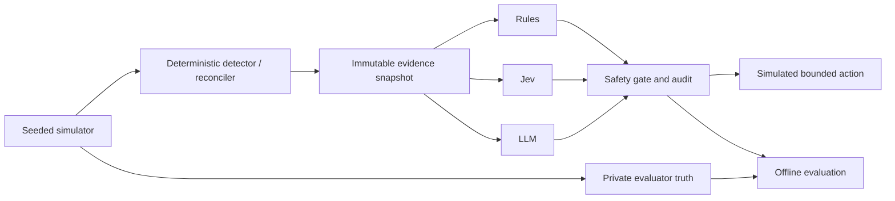

# Architecture

## Runtime boundary



The simulator generates observations; it does not hand a fault label to a decision adapter. Truth, scenario names, seeds, expected actions, and future events remain evaluator-only. Every adapter receives the same JSON-shaped `EvidenceSnapshot` and the same action vocabulary.

The audit record stores the evidence hash, raw recommendation, provider status, elapsed time, and safety-gated effective action. A missing provider key is an `UNAVAILABLE` status, not a substitute decision.

## StreamGuard

The local simulator produces records, feeds a bounded queue, and writes to an idempotent in-memory sink. Sink capacity and behavior determine backlog, latency, errors, and recovery. A detector opens after sustained lag. The evidence builder computes all numeric facts before a decision engine sees them.

Replay requires retained source, a known checkpoint, and a healthy sink. An unsafe recommendation is converted to `ESCALATE` and retained in the audit trail as the raw decision.

## PayRecon

PayRecon uses a simplified lifecycle:

```text
AUTHORIZED → CAPTURED → SETTLED → REFUNDED
```

The current implementation models the first three states. It separates processor source facts from the local projection and deterministically detects duplicates, missing prerequisites, retained delivery gaps, projection mismatches, and conflicting identities or amounts.

`REPLAY` redelivers a known retained event to the local projection only. `RECONCILE` operates only on a disposable local projection with complete verified source evidence. Neither action can create a payment event or change funds.

## Repository structure

```text
src/jevops/
  adapters/       Rules, Jev, and LLM decision adapters
  benchmark/      Audit record creation and local smoke-suite evaluation
  streamguard/    Queue/sink simulation and StreamGuard action gate
  payrecon/       Lifecycle simulation and PayRecon action gate
  cli.py          Command-line entry point
tests/            Offline contract and behavior tests
```

## Deliberate limits

This code is a local experiment, not a distributed production platform. It does not include Flink, Spark, Kafka/Redpanda, Grafana, Prometheus, a database server, cloud deployment, or an agent framework. Those components should be added only when the local decision boundary has been validated and a real demo requirement justifies them.
