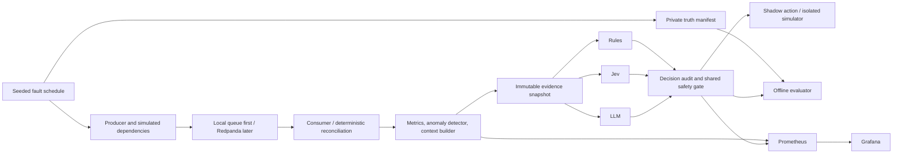

# Architecture and engineering decisions

Status: proposed, 2026-09-20. Defaults can be revised during review; no components are implemented.

## Data flow



The truth manifest is evaluator-only. Simulated dependency observations flow through ordinary instrumentation; the context builder cannot inspect the fault schedule. All three adapters receive one immutable snapshot. Provider calls never run in the event-processing critical path.

## Stack decisions

| Decision | Why / boundary |
| --- | --- |
| Python 3.12, one package, asyncio where needed | Small shared runtime; supports current Jev SDK. Separate tasks/modules, not a service per function. |
| Local queue before Redpanda | Proves the decision boundary and oracle quickly; local performance is never presented as Kafka performance. |
| One Redpanda broker, three partitions per domain topic | Enough to demonstrate lag, replay, and skew; no resilience or production scale claim. Kafka-compatible transport without a separate coordination service. |
| SQLite, embedded in the app | Atomic event dedupe, materialized state, and local restart tests. JSONL holds frozen evidence and results. No Postgres/ClickHouse initially. |
| Prometheus + provisioned Grafana | Actual time-series degradation and recovery, bounded-cardinality decision metrics. No Loki, tracing backend, or custom UI initially. |
| `typesafe-sdk` and one LLM SDK | Thin adapters behind one contract; no agent framework, RAG, tools, or model training. |
| Docker Compose with app/broker/prometheus/grafana | Four services when demo-ready. Broker console is unnecessary initially. Pin images at implementation time. |

The [official Redpanda single-broker example](https://docs.redpanda.com/labs/docker-compose/single-broker/) is a setup reference, not a reason to copy its optional components. Reserve roughly 4–6 GB for Docker as an initial assumption; verify the actual footprint on this arm64 machine before adding load.

## Domain mechanics

**StreamGuard:** producer emits synthetic records at a configurable rate; consumer writes to a local instrumented sink. Fault wrappers change service time, responses, worker availability, or key distribution. Backlog and latency are consequences of work, not prepainted dashboard curves. A local durable sink table keyed by event ID demonstrates bounded replay and duplicate suppression. Commit the broker offset only after the sink transaction; a crash between those steps causes redelivery that dedupe must tolerate.

**PayRecon:** one synthetic processor produces lifecycle events and an independently observable processor snapshot. Delivery faults alter the event stream; projection faults alter the local materialized ledger view. Reconciliation compares observed event state to the latest available processor snapshot, including its freshness. A simulator-only oracle records the authoritative lifecycle separately. The triage adapter cannot query it. This is a lifecycle/projection reconciliation exercise, not full double-entry accounting.

The app owns producer, consumers, fault controller, context assembly, adapter runner, local persistence, and a small metrics endpoint. A CLI selects domain/scenario and writes fault-control requests to a local control channel; it cannot expose arbitrary commands. HTTP infrastructure is unnecessary beyond metrics in the MVP.

## Temporal behavior and pressure

Use a seeded logical clock for reproducible offline episodes and wall-clock pacing for live demos. Store event time, arrival time, processing time, and decision time separately. Never report accelerated simulation time as API latency.

Initial demo defaults: one-second observation ticks, five-second metric windows, three consecutive breached windows before a lag incident opens, and two clean windows before closure. A confirmed integrity mismatch opens immediately. One decision is emitted on opening and at a meaningful evidence change, with a ten-second cooldown and at most three evaluations per episode. These are demo policies to freeze before evaluation, not industry SLAs.

Use bounded queues; coalesce superseded snapshots and count dropped/deferred decisions. Keep broker consumption moving during provider slowness. A response carries the evidence version; stale responses are audited and not applied. Context-to-action freshness limit is initially ten wall-clock seconds in live mode, separate from provider timeout.

## Proposed repository layout

Only the Markdown planning files exist today. Create the rest as each milestone needs it.

```text
JevOps/
  README.md, ROADMAP.md, AGENTS.md
  docs/
    architecture.md, scenarios.md, decision-contract.md
    benchmark-methodology.md, jev-integration.md, demo.md
  pyproject.toml, uv.lock, .env.example, .gitignore
  src/jevops/
    cli.py
    contracts.py                 # validated evidence/result types
    runner.py                    # snapshots, deadlines, audit
    adapters/{rules,jev,llm}.py
    streamguard/{simulation,detector,context,actions}.py
    payrecon/{simulation,state_machine,reconcile,context,actions}.py
    benchmark/{generate,oracle,evaluate,report}.py
    storage.py, metrics.py
  configs/
    policies/                    # deadlines, gates, rule definitions
    questions/                   # shared label rubrics, provider renderings
    scenarios/                   # generation ranges, splits, demo seeds
  tests/{unit,integration,fixtures}/
  infra/
    compose.yaml, Dockerfile
    prometheus/prometheus.yml
    grafana/{provisioning,dashboards}/
  artifacts/                     # ignored run data; synthetic only
  reports/                       # curated manifests, findings, small plots
```

Prefer combining tiny modules over empty abstractions. `oracle` must not import the rule adapter; adapters must not import `oracle` or access manifest files. Test this boundary explicitly.

## Deferred and rejected scope

No Flink/Spark checkpoint system: ordinary consumer offset/checkpoint behavior is enough. No broker failover, cloud deployment, real processor API, FX, fees, disputes, partial captures/refunds, or production remediation. Network faults are application-level delays/timeouts, clearly labeled; they do not test kernel networking. No model-generated prose is needed to make the demo intelligible.

Do not add an ML training pipeline even if a vendor cookbook includes one. Reconsider only if the user later asks a distinct research question that needs training; this plan does not.
