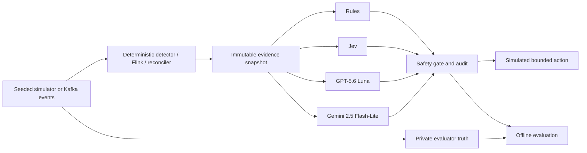

# Architecture

## Runtime boundary



The simulator generates observations; it does not hand a fault label to a decision adapter. Truth, scenario names, seeds, expected actions, and future events remain evaluator-only. Every adapter receives the same JSON-shaped `EvidenceSnapshot` and the same action vocabulary.

The audit record stores the evidence hash, raw recommendation, provider status, elapsed time, and safety-gated effective action. A missing provider key is an `UNAVAILABLE` status, not a substitute decision.

## StreamGuard

The offline simulator still produces records, feeds a bounded queue, and writes to an idempotent in-memory sink. The live demo adds a separate path: a seeded generator emits explicit operational samples to Kafka and a keyed Flink job maintains a ten-sample rolling window. Flink deterministically calculates error rate, backlog and throughput trends, p95 sink latency, consecutive failures, recovery trend, and lateness, then publishes the same `EvidenceSnapshot` contract used by the benchmark.

The Python decision worker consumes those snapshots. Every decision cycle sends one snapshot to Rules, Jev, GPT-5.6 Luna, and Gemini 2.5 Flash-Lite, applies the existing safety gate, writes an audit record to the decisions topic and stdout, and exports a compact Prometheus metric set. Flink never imports or invokes a decision adapter.

Replay requires retained source, a known checkpoint, and a healthy sink. An unsafe recommendation is converted to `ESCALATE` and retained in the audit trail as the raw decision.

## PayRecon

PayRecon uses a simplified lifecycle:

```text
AUTHORIZED → CAPTURED → SETTLED → REFUNDED
```

The current implementation models the first three states. It separates processor source facts from the local projection and deterministically detects duplicates, missing prerequisites, retained delivery gaps, projection mismatches, and conflicting identities or amounts.

`REPLAY` redelivers a known retained event to the local projection only. `RECONCILE` operates only on a disposable local projection with complete verified source evidence. Neither action can create a payment event or change funds.

## Repository structure

```text
src/jevops/
  adapters/       Rules, Jev, GPT, and Gemini decision adapters
  benchmark/      Audit record creation and local smoke-suite evaluation
  streamguard/    Queue/sink simulation and StreamGuard action gate
  streaming/      Kafka scenario generator and live decision worker
  payrecon/       Lifecycle simulation and PayRecon action gate
  cli.py          Command-line entry point
tests/            Offline contract and behavior tests
flink/            Deterministic Java Flink evidence job
observability/    Prometheus scrape config and one Grafana dashboard
```

## Deliberate limits

This remains a local demo rather than a production platform. Kafka and Flink run as single-node containers; there is no authentication, high availability, schema registry, database, cloud deployment, or action executor. Kafka payloads stay intentionally small and JSON-shaped for inspectability.
