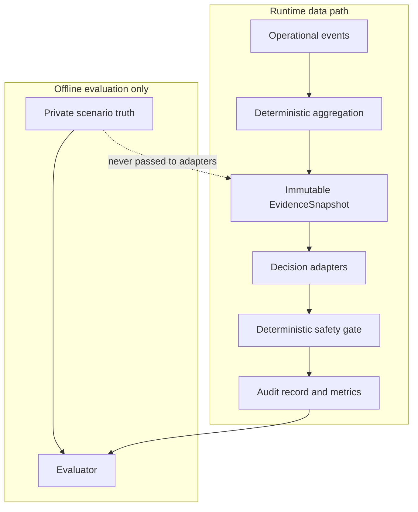
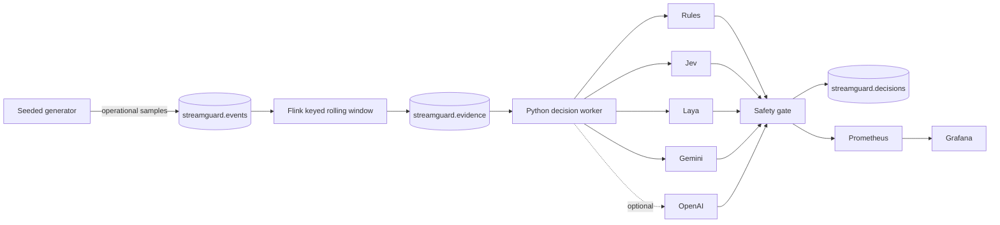

# Architecture

## Design goal

JevOps separates **observable state**, **model judgment**, **deterministic safety policy**, and **evaluation truth**. This makes provider comparisons inspectable and prevents a model from seeing the answer used to score it.

## Trust boundaries


```mermaid
flowchart TB
    subgraph Runtime[Runtime data path]
        O[Operational events] --> A[Deterministic aggregation]
        A --> E[Immutable EvidenceSnapshot]
        E --> P[Decision adapters]
        P --> G[Deterministic safety gate]
        G --> U[Audit record and metrics]
    end

    subgraph Evaluation[Offline evaluation only]
        T[Private scenario truth] --> V[Evaluator]
        U --> V
    end

    T -. never passed to adapters .-> E
```

The evidence contract contains facts, observations, allowed actions, an incident identifier, and a version. It excludes scenario names, seeds, acceptable answers, unsafe-answer labels, and future observations. Its canonical JSON representation is hashed; all engines in a benchmark case must share that hash.

## Live StreamGuard path


```mermaid
flowchart LR
    G[Seeded generator] -->|operational samples| K1[(streamguard.events)]
    K1 --> F[Flink keyed rolling window]
    F --> K2[(streamguard.evidence)]
    K2 --> W[Python decision worker]
    W --> R[Rules]
    W --> J[Jev]
    W --> L[Laya]
    W --> M[Gemini]
    W -. optional .-> O[OpenAI]
    R --> S[Safety gate]
    J --> S
    L --> S
    M --> S
    O --> S
    S --> K3[(streamguard.decisions)]
    S --> P[Prometheus]
    P --> D[Grafana]
```

The Flink job maintains a ten-sample keyed window and computes rates, backlog trend, error counts, p95 sink latency, consecutive failures, recovery trend, and lateness. Flink publishes evidence and never imports a provider adapter.

The worker calls Rules, Jev, Laya, and Gemini by default. OpenAI is present as an optional adapter and is disabled unless `OPENAI_ENABLED=true`. Missing credentials yield `UNAVAILABLE`; no provider is replaced with a fixture or synthetic answer.

## Offline benchmarks

The offline StreamGuard simulator and PayRecon state machine create the same evidence contract without Kafka or Flink. The benchmark runner:

1. builds one evidence snapshot for a scenario and seed;
2. gives that exact snapshot to every configured adapter;
3. records the raw decision and provider metadata;
4. applies the domain safety gate;
5. scores the raw result against evaluator-only truth; and
6. writes auditable JSONL plus an engine summary.

Provider calls are sequential. `--runs N` repeats requests without application-level response caching.

## Decision engines

All adapters return one `DecisionResult` contract: engine identity, provider status, incident class, recommended action, latency, provider model, and metadata.

- **Rules** are local and deterministic.
- **Jev** uses typed `Choice` questions through the TypeSafe SDK.
- **Laya** performs local choice inference. The default is the repository-root general English checkpoint; the model object is reused within the process.
- **Gemini** uses a strict JSON response schema and temperature zero.
- **OpenAI** uses the same prompt and JSON schema as Gemini when explicitly enabled.

Laya timing covers warm local inference and excludes checkpoint loading. Remote timing covers the API round trip. These latency scopes are stored in each result.

## Safety gates

The gate receives only observable evidence and the provider's recommendation. It never sees evaluator truth.

### StreamGuard

- `WAIT` requires remaining wait budget and an open deadline.
- `RETRY` requires retry budget and a known checkpoint.
- `PAUSE` requires storage or capacity headroom.
- `REPLAY` requires a confirmed gap, retained source, known checkpoint, and healthy sink.
- Failed prerequisites become `ESCALATE` and remain visible beside the raw recommendation.

### PayRecon

- `WAIT` is allowed only inside delivery policy.
- `REPLAY` requires a known retained, non-conflicting missing event.
- `RECONCILE` requires complete verified source facts, a disposable projection, a verified mismatch, no pending prerequisite, and no integrity conflict.
- Actions that fail these conditions become `ESCALATE`.

The gate records policy outcomes; it does not execute the effective action.

## Audit record

Each output row contains:

- the full evidence and its SHA-256 hash;
- raw provider status, class, action, latency, and metadata;
- raw, effective, and applied gate actions plus an override reason;
- evaluator truth and scoring in offline benchmark files only; and
- benchmark run and seed metadata.

Live decision records omit evaluator truth and keep the evidence hash, version, decision, gate result, and confidence.

## Failure behavior

- Missing provider credentials: `UNAVAILABLE`
- Provider deadline: `TIMEOUT`
- Invalid structured response: `INVALID_OUTPUT`
- Other provider or local model error: `SERVICE_ERROR`
- Non-`OK` decisions never produce an effective action
- Kafka offsets are committed only after decisions are published successfully

## Repository structure

```text
src/jevops/adapters/    provider adapters and shared decision rubric
src/jevops/benchmark/   scoring, summaries, and result writers
src/jevops/streamguard/ simulator and StreamGuard safety gate
src/jevops/streaming/   generator, Kafka worker, and live evidence processor
src/jevops/payrecon/    lifecycle simulator and PayRecon safety gate
flink/                  Java rolling-evidence job
observability/          Prometheus scrape and Grafana provisioning
results/                versioned synthetic benchmark and live evidence
scripts/                result integrity verification
tests/                  contract, adapter, safety, and benchmark tests
```

## Deployment limits

The Compose stack is a local reference environment: one Kafka broker, one Flink job manager, one task manager, no authentication, no schema registry, no database, and no high availability. It is suitable for repeatable demonstrations and architecture evaluation, not production deployment.
